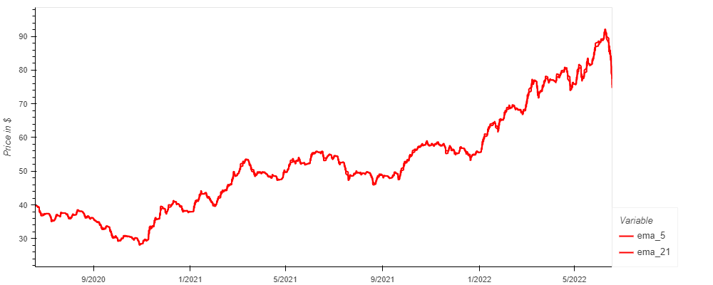
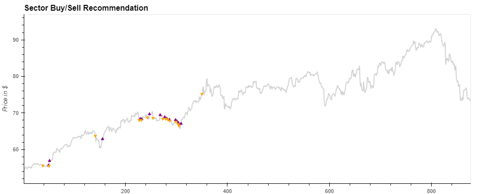

# Sector Investing Strategy

## Hello and Welcome to our group project! 

With thousands of stocks to invest in, it can be overwhelming for you to pick the right profitable stock. 

- Where do you start? 

- What metrics do you look at?

- What type of analysis and resources to use?

We narrow it down for you by offering a sector analysis and investment strategy that present several benefits: 

- Seek Alpha

- Position for business cycles

- Understand nature of the market

We want to provide you with a stock and ETF investment strategy based on a sector analysis.  Our product explains the direction of the money flow in each sector.

Sector investing is a top-down investment strategy  and a way of capitalizing on market shifts caused by changing business conditions and investor focus.

We specialize in giving buy & sell recommendations for 8 different sectors with the goal to outperform the S&P 500. In order to provide those buy & sell recommendations, we have built a machine learning model that takes in considerations several factors such as:

- Closing Price
- Correlation
- Relative Strenght Index 
- Exponential Moving Average
- 10 year treasury yield

Since we want to provide buy/sell recommendations and not the prediction of the price, we used a classification model: Support Vector Machine. 

As an additional validation feature, we have built a Twitter sentiment analysis tool to get the sentiment polarity scores of the market. One of the challenges we faced is that a lot of tweets are from bots accounts or are completely out of context/value and could skew our results. Therefore we decided to limit our twitter API pull to specific accounts such as reputable news outlet (Yahoo Finance, Bloomberg, Wall Street Journal) as well as famous traders/analysts. We also decided to not include the sentiment analysis scores in our machine learning model featurs since we can only pull recent tweets and not historical data to match our sectors data timeframes. 
___

### Team members
   - Ali Ait
   - Kevin Calderon
   - Hassan Mehmood
   - Sarvan Veluppillai

&nbsp;

### Data sources
- [Yahoo Finance](https://ca.finance.yahoo.com/)
- [Twitter Sentiment API](https://developer.twitter.com/en/docs/tutorials/how-to-analyze-the-sentiment-of-your-own-tweets)

&nbsp;

### Notebooks
- [Sector Analysis](Notebook_Files/Model_Analysis.ipynb) &nbsp; 
- [Sentiment Analysis](Notebook_Files/Sentiment_Analysis.ipynb) &nbsp; 

&nbsp;

### PowerPoint
- [Sector Investing Strategy](https://github.com/Nithy29/Project-2/blob/main/Startup%20Presentation%20Deck.pdf)

### Graphs
- Correlation plot 

- Moving Average plot 

- Overall Position Predition plot 

- Performance Metrics plot 

